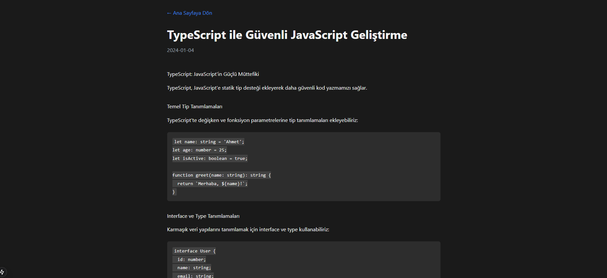

# Blog Project

Bu proje, Cursor IDE'nin AI destekli özelliklerini test etmek amacıyla tamamen Cursor kullanılarak geliştirilmiştir. Proje, modern web teknolojileri kullanılarak oluşturulmuş bir blog uygulamasıdır.

## Teknolojiler

- Next.js 15
- TypeScript
- Tailwind CSS
- React Markdown

## Ekran Görüntüleri

## Özellikler

- Modern ve responsive tasarım
- Dark mode desteği
- Markdown blog yazıları
- SEO dostu yapı

## Geliştirme

Bu proje, Cursor IDE'nin yapay zeka destekli özelliklerini kullanarak geliştirilmiştir. Tüm kod yazımı, düzenleme ve debugging işlemleri Cursor'un AI pair programming özellikleri kullanılarak gerçekleştirilmiştir.
